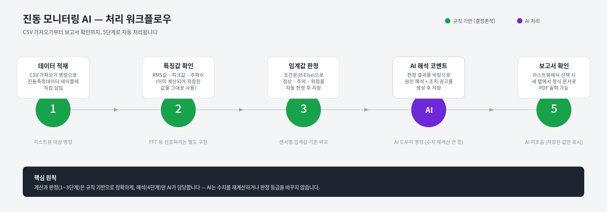

# 진동 모니터링 AI (Vibration Monitoring AI)

진동 센서에서 수집한 RMS·피크값을 **규칙 기반으로 판정**하고, **AI는 판정 결과를 해석하는 코멘트만 생성**하는 설비 이상 감지 시스템입니다. 



## 핵심 설계 원칙

> **계산과 판정은 규칙(수식)으로, 해석은 AI로.**

AI에게 판단을 맡기면 같은 상황에서도 매번 다른 결과를 낼 위험이 있습니다. 이 시스템은 그래서 역할을 명확히 나눴습니다.

| 단계 | 담당 | 방식 |
|---|---|---|
| 임계값 판정 (정상/주의/위험) | 규칙 기반 | 조건문(If-Else) 수식 |
| 판정 근거 문구 생성 | 규칙 기반 | 텍스트 조합 수식 |
| 원인 해석 및 조치 권고 | AI | AI 도우미 명령 (수치 재계산 없음) |

AI는 이미 확정된 판정 결과를 받아서 "왜 이런 결과가 나왔는지"만 설명합니다. 판정 등급을 스스로 바꾸거나 수치를 재계산하지 않습니다.

## 주요 기능

- 📊 **대시보드** — 전체/정상/주의/위험 KPI 카드, 판정등급 분포 도넛 차트, 측정별 RMS값 막대 차트
- 📥 **CSV 일괄 가져오기** — 원본 측정 데이터를 CSV로 한 번에 등록
- ⚡ **실시간 판정 미리보기** — 값을 입력하는 즉시(AI 호출 없이) 임계값 판정 결과를 미리 확인
- 🤖 **AI 해석 코멘트** — 판정 결과를 바탕으로 원인과 조치를 자연어로 설명
- 📄 **정식 문서 양식 보고서** — 문서번호·레터헤드·서명란까지 갖춘 PDF 출력 가능한 보고서
- 🔗 **리스트뷰 → 새 탭 보고서** — 측정 목록에서 행을 선택하면 새 탭에서 해당 보고서가 열림


## 화면 흐름

```
대시보드페이지 ──┬── (측정 등록으로 이동) ──> 측정등록페이지
                  │                              │
                  │                        CSV 가져오기 / 개별 입력
                  │                              │
                  └── (보고서 보기) ──────> 보고서페이지 (리스트뷰)
                                                   │
                                          행 선택 시 새 탭
                                                   ▼
                                          선택한 보고서
                                          (PDF로 내보내기 가능)
```

## 실행 방법
프로젝트 파일을 다운로드 받아 실행하시면 됩니다.
다운로드하신 프로젝트 파일에는 AI 모델 연결 정보(API 키)가 포함되어 있지 않습니다. API 키가 공개적으로 노출되는 것을 방지하기 위해 배포 전 제거한 것이며, 직접 실행해보시려면 API키를 등록하셔야 합니다.


## 실제 Forguncy로 구현 시 참고사항

이 프로토타입의 각 화면은 Forguncy 컴포넌트로 아래와 같이 대응됩니다.

| 프로토타입 요소 | Forguncy 구현 |
|---|---|
| 측정 등록의 CSV 업로드 | 리스트뷰의 "CSV 가져오기와 내보내기" 명령 (리스트뷰 필수, 첫 명령이어야 함) |
| 실시간 판정 미리보기 | 셀 값 변경 시 조건문(If-Else) 즉시 실행 |
| 판정등급/판정근거 | 조건문(If-Else) + 파라미터 설정, 결과를 데이터 테이블에 저장 |
| AI 해석 코멘트 | AI 도우미 명령 (시스템 프롬프트에서 "수치 재계산 금지" 명시) |
| 리스트뷰 → 새 탭 보고서 | 행 클릭 시 파라미터 전달 + "새 탭에서 열기" 명령 |
| PDF 보고서 | Forguncy 보고서(Report) 객체 + 보고서 뷰어 |


